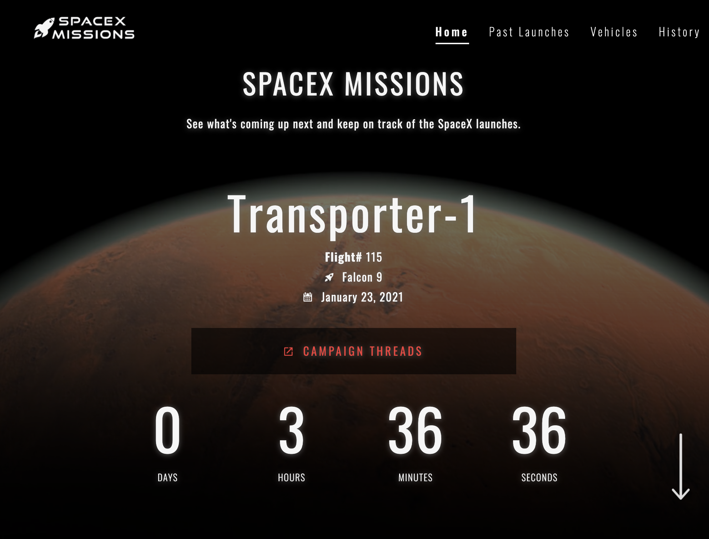
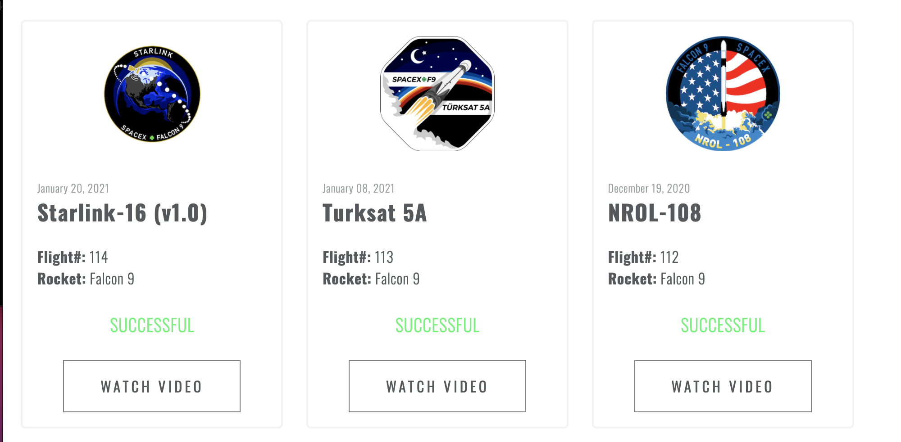
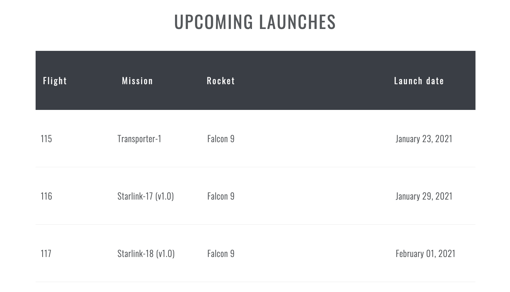

# SpaceX Missions

[Demo app](https://topphestmark.github.io/spacex-missions/)

A microsite of SpaceX missions with time schedule

The project is the part of the project exam assignment for the first semester of my Frontend Development course. With pure HTML, CSS and vanilla Javascript. Framework or libraries were not allowed during the development of this project. The design were kept simple, clean in interactive.

UPDATE: Looking back after a half year went by
Little did I knew how to organize the project modules structure and CSS, so ended up a bit more of duplicating code. Now as I've gained more knowledge regarding to how to write cleaner code and structuring the project I'll definately will build this site over again with integrated stacks and framework.

API source: [SpaceX-API](https://github.com/r-spacex/SpaceX-API/tree/master/docs/v4)

